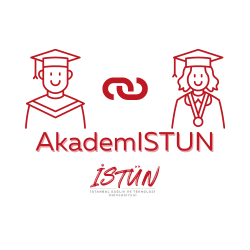
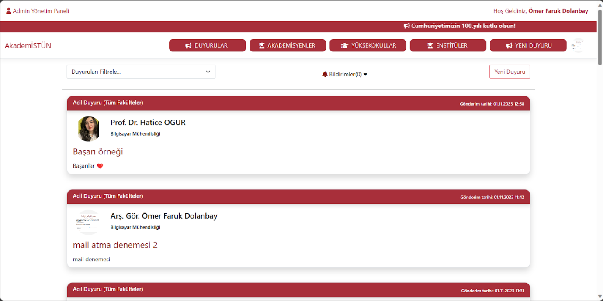
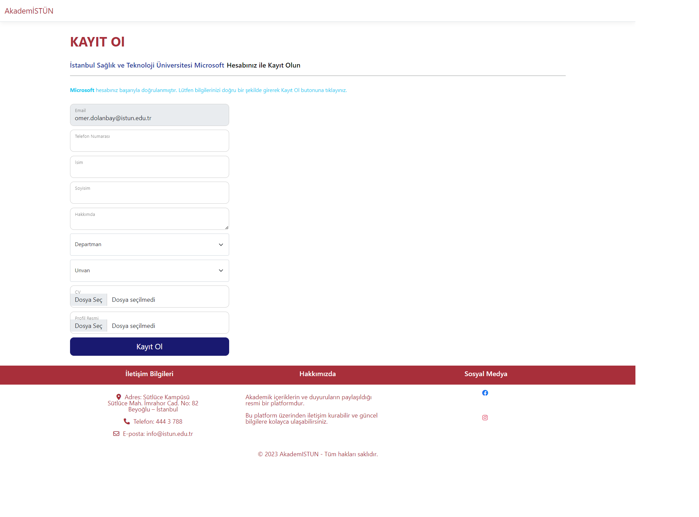
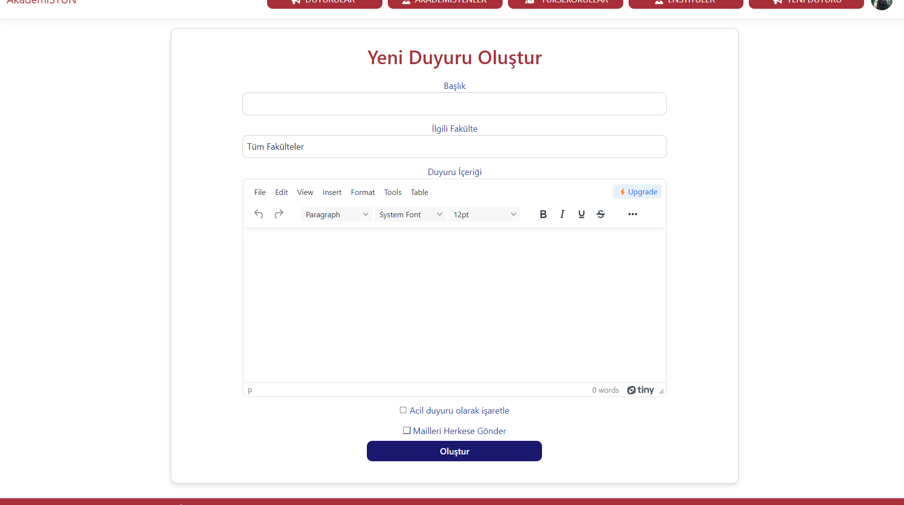
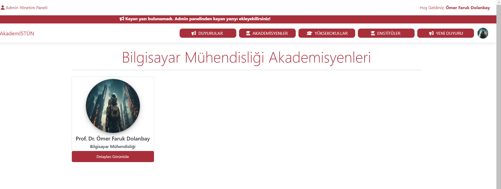
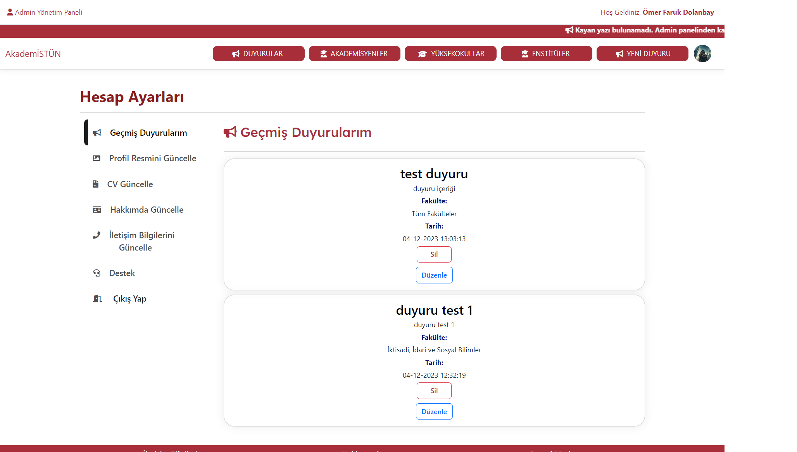
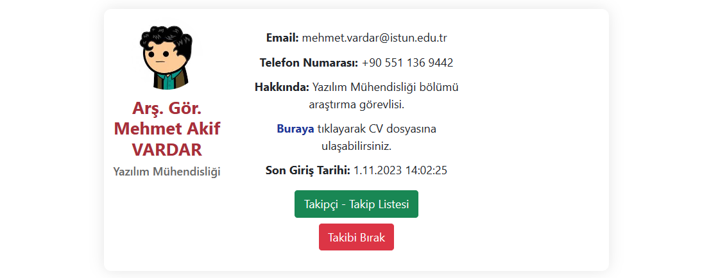

<p align="center">
  <a href="https://github.com/devmehmetakifv/AcademicianPlatform">
    
  </a>

  <h3 align="center">AkademISTUN</h3>

  <p align="center">
    A professional networking platform facilitating connections among academicians.
    <br/>
    <br/>
    <a href="https://github.com/devmehmetakifv/AcademicianPlatform"><strong>Explore the docs »</strong></a>
    <br/>
    <br/>
    <a href="https://github.com/devmehmetakifv/AcademicianPlatform">View Demo</a>
    .
    <a href="https://github.com/devmehmetakifv/AcademicianPlatform/issues">Report Bug</a>
    .
    <a href="https://github.com/devmehmetakifv/AcademicianPlatform/issues">Request Feature</a>
  </p>
</p>

      

## Table Of Contents

* [About the Project](#about-the-project)
* [Built With](#built-with)
* [Getting Started](#getting-started)
  * [Prerequisites](#prerequisites)
  * [Installation](#installation)
* [Usage](#usage)
* [Roadmap](#roadmap)
* [Contributing](#contributing)
* [License](#license)
* [Authors](#authors)
* [Acknowledgements](#acknowledgements)

## About The Project



Introducing AkademISTUN, a pioneering platform in academic and social communication, integrating cutting-edge technologies including ASP.NET Core MVC, HTML, CSS, JavaScript, SQL Server, and Microsoft API framework. Conceived by Dr. Nazlı Tokatlı, it embodies an interdisciplinary approach to research.

Under Dr. Tokatlı's guidance, a team from Computer and Software Engineering departments has developed AkademISTUN, aiming to:

1. Facilitate robust academic collaborations among university departments.
2. Provide a central hub for project tracking, visibility, and information dissemination.
3. Optimize resource allocation by connecting projects with necessary resources.
4. Foster cross-disciplinary team formation to enhance research outcomes.

AkademISTUN revolutionizes academic collaboration, redefining knowledge sharing, resource utilization, and research methodologies within our university, paving the way for a more interconnected and innovative future.


## Built With

AkademISTUN harnesses the power of cutting-edge technologies, including ASP.NET Core MVC, Entity Framework, JavaScript, Bootstrap 5, SQL Server, and Microsoft API, to create a dynamic and innovative platform for academic and social communication.

## Getting Started

To get a local copy up and running, follow these simple example steps.

### Prerequisites

To contribute to the development of AkademISTUN, you need to have a couple of things: 

* .NET SDK
```sh
https://dotnet.microsoft.com/en-us/download
```

* Visual Studio / Visual Studio Code
```sh
https://visualstudio.microsoft.com/downloads/
```

* Entity Framework

* Microsoft SQL Server Management Studio
```sh
https://www.microsoft.com/tr-tr/sql-server/sql-server-downloads
```

### Installation

1. Clone the project
```sh
git clone https://github.com/devmehmetakifv/AcademicianPlatform.git
```

2. Edit appsettings.json and add your own connection string.

3. Edit admins.json and whitelist.json

4. Build the project and upload ```publish``` folder to your IIS.

## Screenshots






## Roadmap

See the [open issues](https://github.com/devmehmetakifv/AcademicianPlatform/issues) for a list of proposed features (and known issues).

## Contributing

Contributions are what make the open source community such an amazing place to be learn, inspire, and create. Any contributions you make are **greatly appreciated**.
* If you have suggestions for adding or removing projects, feel free to [open an issue](https://github.com/devmehmetakifv/AcademicianPlatform/issues/new) to discuss it, or directly create a pull request after you edit the *README.md* file with necessary changes.
* Please make sure you check your spelling and grammar.
* Create individual PR for each suggestion.
* Please also read through the [Code Of Conduct](https://github.com/devmehmetakifv/AcademicianPlatform/blob/main/CODE_OF_CONDUCT.md) before posting your first idea as well.

### Creating A Pull Request

1. Fork the Project
2. Create your Feature Branch (`git checkout -b feature/AmazingFeature`)
3. Commit your Changes (`git commit -m 'Add some AmazingFeature'`)
4. Push to the Branch (`git push origin feature/AmazingFeature`)
5. Open a Pull Request

## License

Distributed under the MIT License. See [LICENSE](https://github.com/devmehmetakifv/AcademicianPlatform/blob/main/LICENSE.md) for more information.

## Authors

* **Mehmet Akif VARDAR** - *Software Engineering* - [Mehmet Akif VARDAR](https://github.com/devmehmetakifv/) - *Project Management, Full Stack Development*
* **Ömer Faruk DOLANBAY** - *Computer Engineering* - [Ömer Faruk DOLANBAY](https://github.com/Esforper) - *Full Stack Development*
* **Burhan ÇALIK** - *Software Engineering* - [Burhan ÇALIK](https://github.com/BurhanCalik) - *Full Stack Development*
* **Hatice OGUR** - *Computer Engineering* - [Hatice OGUR](https://github.com/HaticeOgur) - *Frontend Development*
* **Rumeysa ÇİÇEK** - *Computer Engineering* - [Rumeysa ÇİÇEK](https://github.com/Rumeysacck) - *Frontend Development*
* **Emir KARABİBER** - *Computer Engineering* - [Emir KARABİBER](https://github.com/EmirKarabiber) - *Project Participant*

## Acknowledgements

* [IEEE ISTUN](https://github.com/IEEE-ISTUN)
